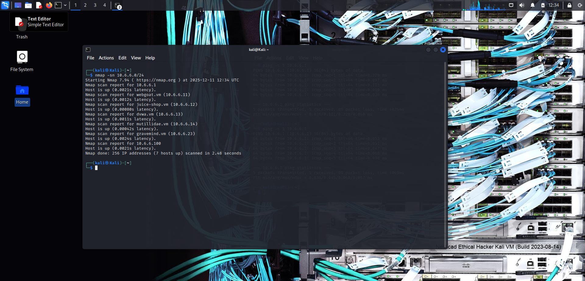
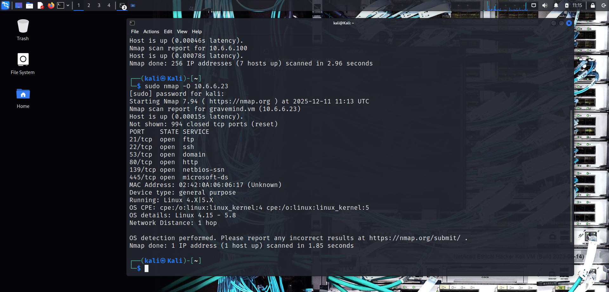
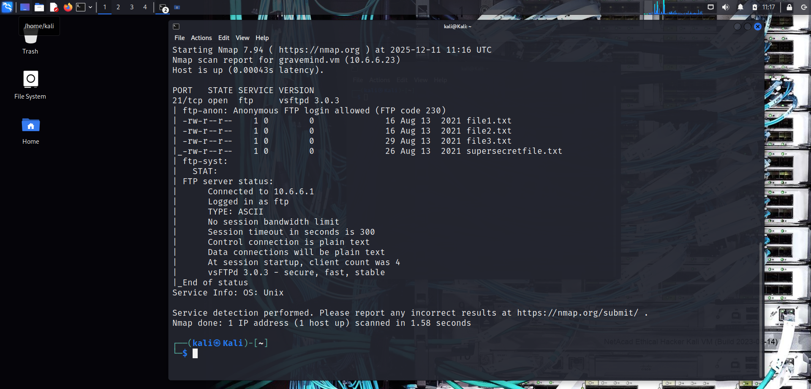
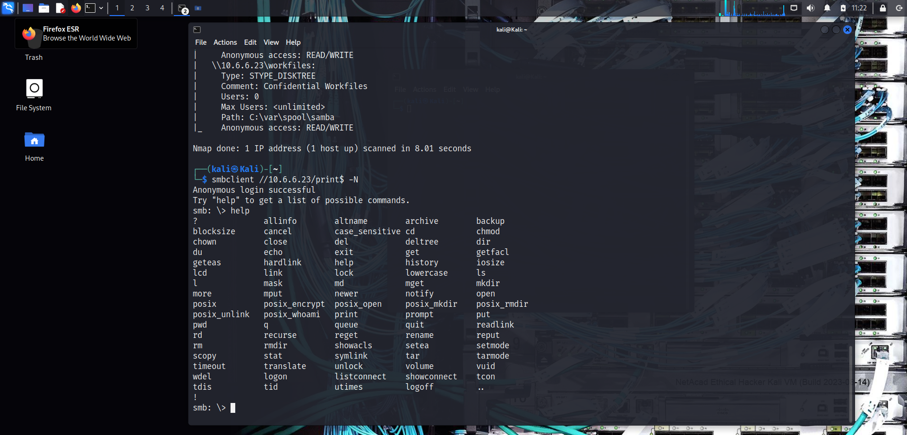
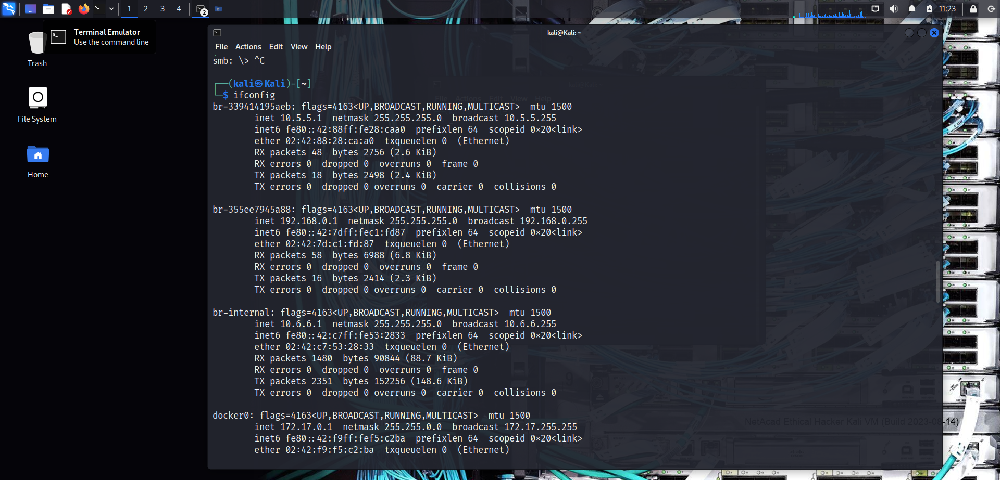
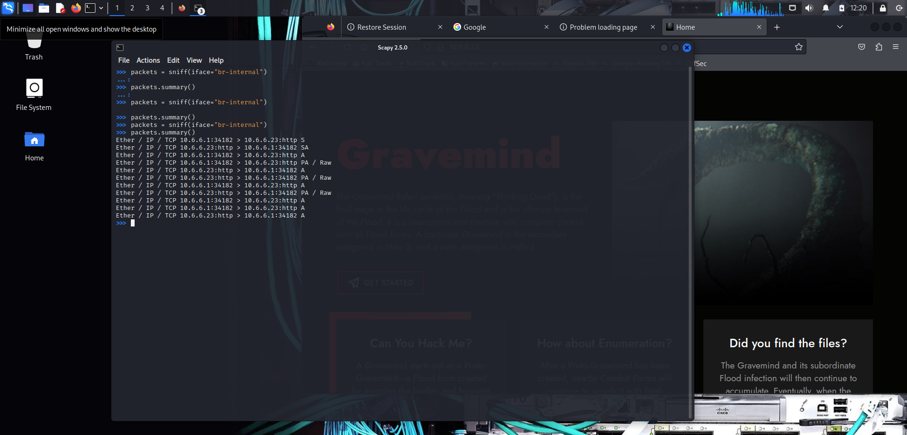
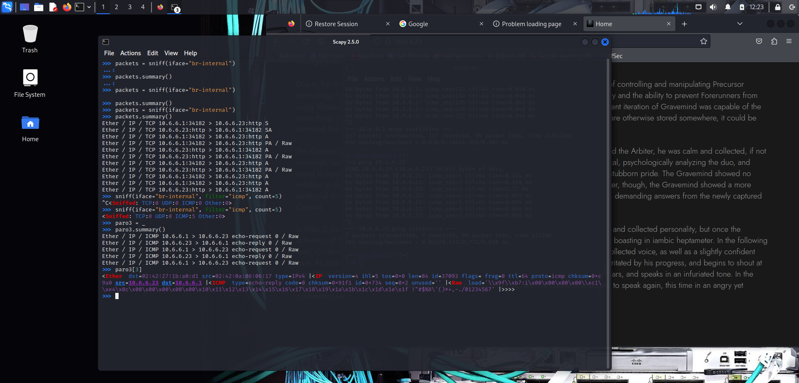

# 🔍 Nmap & Scapy Lab Documentation


> Practical lab documentation covering network reconnaissance with Nmap and packet analysis with Scapy, completed as part of ParoCyber Ethical Hacking Training.

---

## 📋 Table of Contents

- [Objectives](#-objectives)
- [Lab Environment](#-lab-environment)
- [Part 1: Nmap Reconnaissance](#-part-1-nmap-reconnaissance)
  - [Host Discovery](#1-host-discovery)
  - [OS Detection](#2-os-detection)
  - [Service Version Detection](#3-service-version-detection)
  - [SMB Enumeration](#4-smb-enumeration)
  - [SMB Client Connection](#5-smb-client-connection)
- [Part 2: Network Configuration](#-part-2-network-configuration)
- [Part 3: Packet Capture with Tcpdump](#-part-3-packet-capture-with-tcpdump)
- [Part 4: Scapy Packet Analysis](#-part-4-scapy-packet-analysis)
  - [Basic Sniffing](#1-basic-sniffing)
  - [Interface-Specific Sniffing](#2-interface-specific-sniffing)
  - [Filtered Packet Capture](#3-filtered-packet-capture)
- [Key Learnings](#-key-learnings)
- [References](#-references)
- [Author](#-author)

---

## 🎯 Objectives

The objectives of this lab are to:

1. **Understand network reconnaissance** using Nmap for host discovery, port scanning, and service enumeration
2. **Learn OS fingerprinting** techniques to identify target operating systems
3. **Explore SMB enumeration** and understand common Windows network vulnerabilities
4. **Capture network traffic** using tcpdump and analyze with Wireshark
5. **Master Scapy** for packet sniffing, crafting, and protocol analysis

---

## 🖥️ Lab Environment

| Component | Details |
|-----------|---------|
| **Attacker Machine** | Kali Linux |
| **Target Network** | 10.6.6.0/24 |
| **Target Host** | 10.6.6.23 |
| **Network Interface** | eth0, br-internal |
| **Tools Used** | Nmap, Scapy, Tcpdump, Wireshark, SMBClient |

---

## 🔎 Part 1: Nmap Reconnaissance

### 1. Host Discovery

**Command:**
```bash
nmap -sn 10.6.6.0/24
```

**Explanation:**
- `-sn` — Ping scan (disables port scan)
- `10.6.6.0/24` — Target subnet (256 hosts)
- Discovers live hosts on the network without scanning ports
- Useful for initial reconnaissance to identify active targets

**Screenshot:**



---

### 2. OS Detection

**Command:**
```bash
sudo nmap -O 10.6.6.23
```

**Explanation:**
- `-O` — Enable OS detection
- `sudo` — Required for raw socket access
- Uses TCP/IP stack fingerprinting to identify the target's operating system
- Compares responses against Nmap's database of known OS signatures

**Screenshot:**



---

### 3. Service Version Detection

**Command:**
```bash
nmap -p21 -sV -A -T4 10.6.6.23
```

**Explanation:**
- `-p21` — Scan port 21 (FTP)
- `-sV` — Probe open ports to determine service/version info
- `-A` — Aggressive scan (OS detection, version detection, script scanning, traceroute)
- `-T4` — Timing template (faster execution)

**Screenshot:**



---

### 4. SMB Enumeration

**Commands:**
```bash
nmap -A -p139,445 10.6.6.23
```

```bash
nmap --script smb-enum-shares.nse -p445 10.6.6.23
```

**Explanation:**
- `-p139,445` — Target SMB ports (NetBIOS and SMB direct)
- `--script smb-enum-shares.nse` — Nmap script to enumerate SMB shares
- SMB (Server Message Block) is commonly used for file sharing on Windows networks
- Enumeration reveals available shares, permissions, and potential attack vectors

**Screenshot:**


---

### 5. SMB Client Connection

**Command:**
```bash
smbclient //10.6.6.23/print$ -N
```

**Explanation:**
- `smbclient` — Command-line SMB client
- `//10.6.6.23/print$` — Target share (print$ is a default Windows printer share)
- `-N` — No password (null session)
- Type `exit` to close the shell

**Screenshot:**



---

## 🌐 Part 2: Network Configuration

These commands help understand the network environment:

**Command 1: View Network Interfaces**
```bash
ifconfig
```
- Displays IP addresses, MAC addresses, and interface statistics

**Command 2: View Routing Table**
```bash
ip route
```
- Shows the routing table and default gateway

**Command 3: View DNS Configuration**
```bash
cat /etc/resolv.conf
```
- Displays configured DNS servers

**Screenshot:**



---

## 📡 Part 3: Packet Capture with Tcpdump

**Command:**
```bash
sudo tcpdump -i eth0 -s 0 -w ladies.pcap
```

**Explanation:**
- `-i eth0` — Capture on eth0 interface
- `-s 0` — Capture full packets (no truncation)
- `-w ladies.pcap` — Write output to pcap file
- Press `Ctrl + C` to stop capture

**Verify Capture:**
```bash
ls ladies.pcap
```

**Open in Wireshark:**
```bash
wireshark ladies.pcap
```

**Screenshot:**


---

## 🐍 Part 4: Scapy Packet Analysis

### Starting Scapy

```bash
sudo su
scapy
```

> Scapy requires root privileges for raw socket access.

---

### 1. Basic Sniffing

**Commands:**
```python
# Start sniffing (captures all traffic)
sniff()

# In another terminal, generate traffic:
# ping google.com

# Stop sniffing with Ctrl + C

# Store captured packets
paro = _

# View summary
paro.summary()
```

**Explanation:**
- `sniff()` — Captures packets on the default interface
- `_` — Stores the last result in Scapy
- `.summary()` — Displays a summary of captured packets

**Screenshot:**


---

### 2. Interface-Specific Sniffing

**Commands:**
```python
# Sniff on specific interface
sniff(iface="br-internal")

# Generate traffic:
# ping 10.6.6.1
# Open browser: http://10.6.6.23

# Stop with Ctrl + C

# Store and analyze
paro2 = _
paro2.summary()
```

**Explanation:**
- `iface="br-internal"` — Specifies the network interface to sniff on
- Captures traffic only on the internal bridge network

**Screenshot:**



---

### 3. Filtered Packet Capture

**Commands:**
```python
# Capture only ICMP packets, limit to 5
sniff(iface="br-internal", filter="icmp", count=5)

# In another terminal:
# ping 10.6.6.23

# Stop when 5 packets captured

# Store and analyze
paro3 = _
paro3.summary()

# View specific packet (4th packet)
paro3[3]
```

**Explanation:**
- `filter="icmp"` — BPF filter to capture only ICMP (ping) packets
- `count=5` — Stop after capturing 5 packets
- `paro3[3]` — Access individual packets by index (0-based)

**Screenshot:**



---

## 💡 Key Learnings

### Nmap Insights
- **Host discovery** is the first step in any penetration test
- **Service enumeration** reveals potential attack vectors
- **NSE scripts** extend Nmap's capabilities for specific tasks
- **SMB enumeration** is critical for Windows network assessments

### Scapy Insights
- Powerful Python-based tool for packet manipulation
- Can sniff, craft, send, and analyze packets
- BPF filters allow targeted packet capture
- Essential for understanding network protocols at a low level

### Real-World Applications
- **Network security assessments** — Identify vulnerabilities before attackers do
- **Incident response** — Analyze captured traffic during security incidents
- **Penetration testing** — Reconnaissance phase of ethical hacking engagements
- **Network troubleshooting** — Diagnose connectivity and protocol issues

---

## 📚 References

- [Nmap Official Documentation](https://nmap.org/docs.html)
- [Scapy Documentation](https://scapy.readthedocs.io/)
- [Tcpdump Manual](https://www.tcpdump.org/manpages/tcpdump.1.html)
- [Wireshark User Guide](https://www.wireshark.org/docs/wsug_html/)
- [OWASP Testing Guide](https://owasp.org/www-project-web-security-testing-guide/)

---

## 👤 Author

**Aliu Tijani**  
Ethical Hacking Student | ParoCyber Training Program

[](https://www.linkedin.com/in/YOUR-LINKEDIN)
[](https://github.com/YOUR-GITHUB)

---

## 📄 License

This project is licensed under the MIT License - see the [LICENSE](LICENSE) file for details.

---

*Created as part of ParoCyber Ethical Hacking Training — December 2024*
